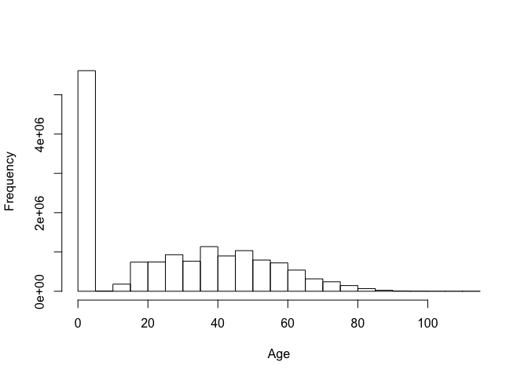
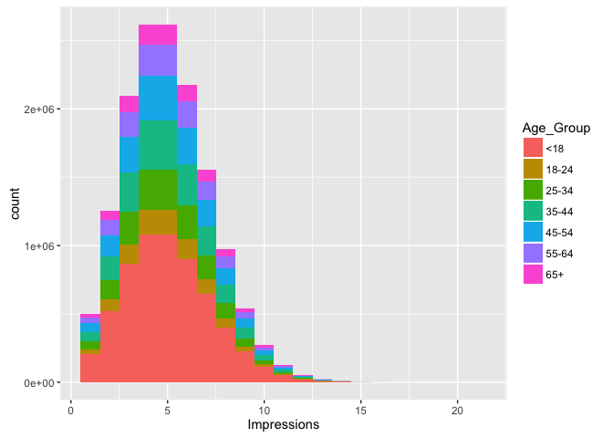

# 2016-0509 MSDS 6304-401 Exploring Website Click Data
Bill Kerneckel  
June 24, 2016  

<br>

#### Introduction


This tutorial is based on the EDA Exercises in the book, Doing Data Science, which I highly recommend.

There are 31 data sets named nyt1.csv, nyt2.csv,…, nyt31.csv, which can be downloaded from GitHub.

Each csv represents one (simulated) days worth of ads shown and clicks recorded on the New York Times homepage in May 2012. Each row in the csv represents a single user.

There are five columns: Age, Gender (0=female, 1=male), Impressions, Clicks, and Signed_In status (0=not signed in, 1=signed in).

Assignment:

1. Download the data
2. Create a new variable in R called "age group"
3. Place the "age group" into the following catagories: < 18, 18-24, 25-34, 35-44, 45-54, 55-64, 65+
4. For all 31 days: Plot distributions of number impressions and click-through-rate (CTR = click/impression) for the age groups.
5. Define new variable to segment users based on click behavior.
6. Explore data and make visual comparisons across user segments.
7. Create metrics/measurement/statistics that summarize the data.


****************************
#### Library needed


```r
library(downloader)
library(ggplot2)
```

#### Setting your working directory

You must set your working directory to the following:


```r
setwd("/Users/wkerneck/desktop/ClickData/")
```


****************************

#### Getting the Data

We will create a loop to in R to pull all 31 .csv files. The files will be downlaoded to your working directory.


```r
nyt <- NULL

for (i in 1:31){  nyt_temp <- read.csv(url(paste("http://stat.columbia.edu/~rachel/datasets/nyt",i,".csv",sep="")));  nyt_temp$day <- i;  nyt <- rbind(nyt,nyt_temp)}

nyt_origin <- nyt
```


****************************


#### Analysis of the data set

Rough analysis of all the datasets. There are 14905865 observations of 6 variables. Below are the details of dataset:


```r
dim(nyt_origin)
```

```
## [1] 14905865        6
```

```r
str(nyt_origin)
```

```
## 'data.frame':	14905865 obs. of  6 variables:
##  $ Age        : int  36 73 30 49 47 47 0 46 16 52 ...
##  $ Gender     : int  0 1 0 1 1 0 0 0 0 0 ...
##  $ Impressions: int  3 3 3 3 11 11 7 5 3 4 ...
##  $ Clicks     : int  0 0 0 0 0 1 1 0 0 0 ...
##  $ Signed_In  : int  1 1 1 1 1 1 0 1 1 1 ...
##  $ day        : int  1 1 1 1 1 1 1 1 1 1 ...
```

```r
summary(nyt_origin)
```

```
##       Age             Gender        Impressions     Clicks       
##  Min.   :  0.00   Min.   :0.0000   Min.   : 0   Min.   :0.00000  
##  1st Qu.:  0.00   1st Qu.:0.0000   1st Qu.: 3   1st Qu.:0.00000  
##  Median : 26.00   Median :0.0000   Median : 5   Median :0.00000  
##  Mean   : 26.24   Mean   :0.3231   Mean   : 5   Mean   :0.09773  
##  3rd Qu.: 46.00   3rd Qu.:1.0000   3rd Qu.: 6   3rd Qu.:0.00000  
##  Max.   :115.00   Max.   :1.0000   Max.   :21   Max.   :6.00000  
##    Signed_In           day       
##  Min.   :0.0000   Min.   : 1.00  
##  1st Qu.:0.0000   1st Qu.: 8.00  
##  Median :1.0000   Median :16.00  
##  Mean   :0.6234   Mean   :15.98  
##  3rd Qu.:1.0000   3rd Qu.:24.00  
##  Max.   :1.0000   Max.   :31.00
```


Let's take a look how the data is distributed through the use of data visualization.


```r
hist(nyt_origin$Age, main="", xlab="Age")
```

<!-- -->


```r
hist(nyt_origin$Impressions, main="", xlab="# of Impressions")
```

<!-- -->


```r
range(nyt_origin$Clicks)
```

```
## [1] 0 6
```

****************************


#### Task 1

Create a new variable named "Age_group", that groups users into age categories into the following: < 18, 18-24, 25-34, 35-44, 45-54, 55-64, 65+


```r
nyt_origin$Age_Group <- cut(nyt_origin$Age, c(-Inf, 18, 24, 34, 44, 54, 64, Inf))

levels(nyt_origin$Age_Group) <- c("<18", "18-24", "25-34", "35-44", "45-54", "55-64", "65+")
```

Take a look at the changes:


```r
head(nyt_origin)
```

```
##   Age Gender Impressions Clicks Signed_In day Age_Group
## 1  36      0           3      0         1   1     35-44
## 2  73      1           3      0         1   1       65+
## 3  30      0           3      0         1   1     25-34
## 4  49      1           3      0         1   1     45-54
## 5  47      1          11      0         1   1     45-54
## 6  47      0          11      1         1   1     45-54
```
<br>

#### Task 2

For a single day, plot the distributions of ‘number of impressions’ and ‘click-through-rate’ by Age_Group. (CTR = clicks/impressions).

2.1) Create a subset of data1 to exclude rows where there are no impressions (if there are no impressions, we assume there will be no clicks). Name the new object CTR


```r
nytsub <- subset(nyt_origin, Impressions>0)
```

<br>

2.2) Add a column called CTR containing the click-through-rate per Day


```r
nytsub$CTR <- nytsub$Clicks/nytsub$Impressions

head(nytsub)
```

```
##   Age Gender Impressions Clicks Signed_In day Age_Group        CTR
## 1  36      0           3      0         1   1     35-44 0.00000000
## 2  73      1           3      0         1   1       65+ 0.00000000
## 3  30      0           3      0         1   1     25-34 0.00000000
## 4  49      1           3      0         1   1     45-54 0.00000000
## 5  47      1          11      0         1   1     45-54 0.00000000
## 6  47      0          11      1         1   1     45-54 0.09090909
```

<br>

2.3) Plot the distribution of Impressions>0, grouped by Age_Group, using the ggplot2 package


```r
ggplot(subset(nytsub, Impressions>0), aes(x=Impressions, fill=Age_Group))+
    geom_histogram(binwidth=1)
```

<!-- -->

<br>

2.4) Plot the distribution of CTR>0, grouped by day for the month of May 2012


```r
ggplot(subset(nytsub, Impressions>0), aes(x=day, fill=Impressions))+
 geom_histogram(binwidth=.5)
```

<!-- -->
