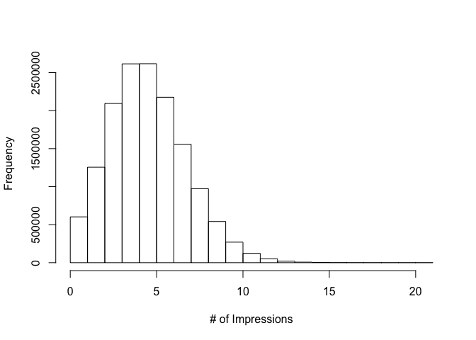

# 2016-0509 MSDS 6304-401 Exploring Website Click Data
Bill Kerneckel  
June 24, 2016  

<br>

#### Introduction


This tutorial is based on the EDA Exercises in the book, Doing Data Science, which I highly recommend.

There are 31 data sets named nyt1.csv, nyt2.csv,…, nyt31.csv, which can be downloaded from GitHub.

Each csv represents one (simulated) days worth of ads shown and clicks recorded on the New York Times homepage in May 2012. Each row in the csv represents a single user.

There are five columns: Age, Gender (0=female, 1=male), Impressions, Clicks, and Signed_In status (0=not signed in, 1=signed in).

Assignment:

1. Download the data
2. Create a new variable in R called "age group"
3. Place the "age group" into the following catagories: < 18, 18-24, 25-34, 35-44, 45-54, 55-64, 65+
4. For a single day: Plot distributions of number impressions and click-through-rate (CTR = click/impression) for the age groups.
5. Define new variable to segment users based on click behavior.
6. Explore data and make visual comparisons across user segments.
7. Create metrics/measurement/statistics that summarize the data.


****************************
#### Library needed


```r
library(downloader)
library(ggplot2)
```

#### Setting your working directory

You must set your working directory to the following:


```r
setwd("/Users/wkerneck/desktop/ClickData/")
```


****************************

#### Getting the Data

Create a data frame called daytweleve_data from the nyt12.csv.


```r
download("http://stat.columbia.edu/~rachel/datasets/nyt12.csv", destfile="nyt12.csv")

cat("Data downloaded into current working directory")
```

```
## Data downloaded into current working directory
```

****************************


#### Analysis of the data set

Rough analysis of the datasets. The nyt12.csv dataframe has 396308 observations of 5 variables. Below are the details of dataset:

nyt12.csv


```r
daytwelve_data <- read.csv("nyt12.csv")
dim(daytwelve_data)
```

```
## [1] 396308      5
```

```r
str(daytwelve_data)
```

```
## 'data.frame':	396308 obs. of  5 variables:
##  $ Age        : int  29 0 27 0 69 0 0 39 53 27 ...
##  $ Gender     : int  0 0 0 0 1 0 0 1 0 1 ...
##  $ Impressions: int  4 1 2 5 9 1 6 4 7 3 ...
##  $ Clicks     : int  1 0 0 1 1 0 0 0 0 0 ...
##  $ Signed_In  : int  1 0 1 0 1 0 0 1 1 1 ...
```

```r
summary(daytwelve_data)
```

```
##       Age             Gender        Impressions         Clicks       
##  Min.   :  0.00   Min.   :0.0000   Min.   : 0.000   Min.   :0.00000  
##  1st Qu.:  0.00   1st Qu.:0.0000   1st Qu.: 3.000   1st Qu.:0.00000  
##  Median : 31.00   Median :0.0000   Median : 5.000   Median :0.00000  
##  Mean   : 29.43   Mean   :0.3619   Mean   : 5.001   Mean   :0.09275  
##  3rd Qu.: 48.00   3rd Qu.:1.0000   3rd Qu.: 6.000   3rd Qu.:0.00000  
##  Max.   :105.00   Max.   :1.0000   Max.   :18.000   Max.   :4.00000  
##    Signed_In     
##  Min.   :0.0000  
##  1st Qu.:0.0000  
##  Median :1.0000  
##  Mean   :0.6988  
##  3rd Qu.:1.0000  
##  Max.   :1.0000
```


Let's take a look how the data is distributed through the use of data visualization.


```r
hist(daytwelve_data$Age, main="", xlab="Age")
```

<!-- -->


```r
hist(daytwelve_data$Impressions, main="", xlab="# of Impressions")
```

<!-- -->


```r
range(daytwelve_data$Clicks)
```

```
## [1] 0 4
```

****************************


#### Task 1

Create a new variable named "Age_group", that groups users into age categories into the following: < 18, 18-24, 25-34, 35-44, 45-54, 55-64, 65+


```r
daytwelve_data$Age_Group <- cut(daytwelve_data$Age, c(-Inf, 18, 24, 34, 44, 54, 64, Inf))

levels(daytwelve_data$Age_Group) <- c("<18", "18-24", "25-34", "35-44", "45-54", "55-64", "65+")
```

<br>

#### Task 2

For a single day, plot the distributions of ‘number of impressions’ and ‘click-through-rate’ by Age_Group. (CTR = clicks/impressions).

2.1) Create a subset of data1 to exclude rows where there are no impressions (if there are no impressions, we assume there will be no clicks). Name the new object d1


```r
d1 <- subset(daytwelve_data, Impressions>0)
```

<br>

2.2) Add a column to d1 called CTR containing the click-through-rate


```r
d1$CTR <- d1$Clicks/d1$Impressions

head(d1)
```

```
##   Age Gender Impressions Clicks Signed_In Age_Group       CTR
## 1  29      0           4      1         1     25-34 0.2500000
## 2   0      0           1      0         0       <18 0.0000000
## 3  27      0           2      0         1     25-34 0.0000000
## 4   0      0           5      1         0       <18 0.2000000
## 5  69      1           9      1         1       65+ 0.1111111
## 6   0      0           1      0         0       <18 0.0000000
```

<br>

2.3) Plot the distribution of Impressions>0, grouped by Age_Group, using the ggplot2 package


```r
ggplot(subset(d1, Impressions>0), aes(x=Impressions, fill=Age_Group))+
    geom_histogram(binwidth=1)
```

<!-- -->

<br>

2.4) Plot the distribution of CTR>0, grouped by Age_Group


```r
ggplot(subset(d1, CTR>0), aes(x=CTR, fill=Age_Group))+
    labs(title="Click-through rate by age group (05/12/2012)")+
    geom_histogram(binwidth=.025)
```

<!-- -->
